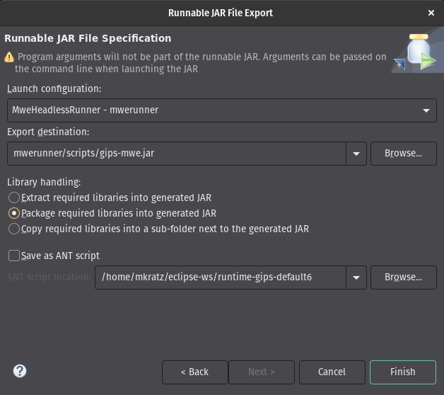

# GIPS framework headless: Minimal Working Example

This is a Minimal Working Example (MWE) on how to run the [GIPS framework](https://gips.dev) headlessly via scripts.

## Setup

* Install [GIPS](https://github.com/Echtzeitsysteme/gips) as described in its [repository](https://github.com/Echtzeitsysteme/gips).
* Launch a runtime workspace (while using a runtime Eclipse) as stated in the eMoflon::IBeX installation steps. (Please refer to the installation steps of GIPS above.)
* Import all of the projects of this repository.
* Build all your projects with the black eMoflon hammer. Sometimes, it is required to trigger a cleaning in Eclipse (*Project -> Clean... -> Clean all projects*).
* The runner project contains a runnable Java class with a `main` function.
    * You can execute it directly in Eclipse.

### Headless Setup

This MWE is about getting a GIPS optimization pipeline to execute headlessly, i.e., as a "fat" JAR file on the CLI.

* Execute the `main` function of the runner project once in your runtime Eclipse workspace. Without any arguments, it will throw an `IllegalArgumentException`, which is fine for now.
* Within your runtime Eclipse workspace, click on *File -> Export... -> Java -> Runnable Jar file*.
* Select the previously (automatically) created *Launch configuration* of the `MweHeadlessRunner` class.
* Choose an export destination. A good first starting point is `./mwerunner/scripts/gips-mwe.jar` as it simplifies the following steps.
* Under *Library handling* choose *Package required libraries into generated JAR*.
* Click on *Finish*.
    * If the process fails with a compiler warning, try to clean your workspace and start the export again.



### Headless Execution

After you exported the "fat" JAR file, you can use the following steps to execute it headlessly.

* Copy `./mwerunner/scripts/{env.sh,start-gips.sh}` as well as your exported JAR file to whatever destination you want to execute it from. (This could be, e.g., a remote system without a GUI.)
    * Make sure your destination system has the required dependencies (Java runtime v21(+), GUROBI solver in the appropriate version) installed.
* Adapt `env.sh` to fit your system, i.e., adapt the path(s) GUROBI is installed to and also configure your GUROGI license file.
* Start the whole GIPS optimization pipeline: `$ ./start-gips.sh`.
* If everything goes as expected, it will finish with:

```
[...]
GIPS run finished.
# => GIPS start script done.
```


## Project Overview

| **Name**       | **Description**                                                                   |
| -------------- | --------------------------------------------------------------------------------- |
| `mwemetamodel` | Small example metamodel.                                                          |
| `mwegipsl`     | GIPS project that can be used to optimize model instances of the above metamodel. |
| `mwerunner`    | Classes related to the execution of the optimization pipeline.                    |

For more projects, refer to the [GIPS examples repository](https://github.com/Echtzeitsysteme/gips-examples) or the [GIPS test repository](https://github.com/Echtzeitsysteme/gips-tests).


## License

See [LICENSE](./LICENSE).
